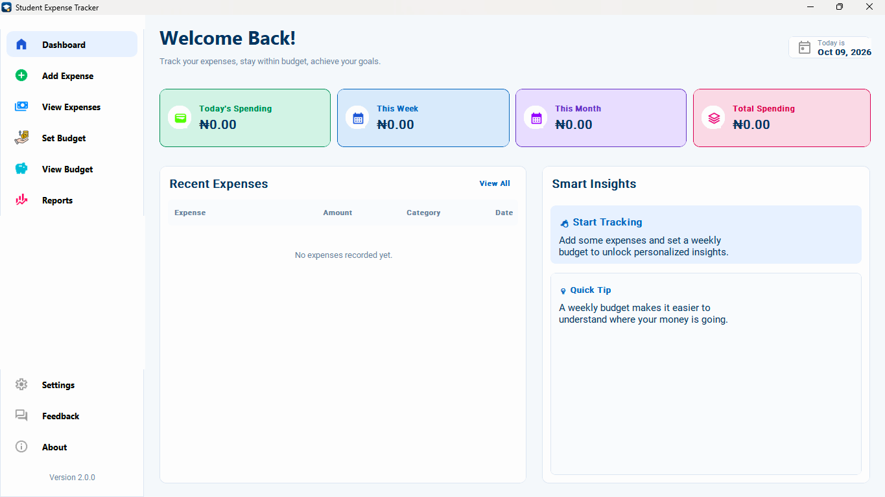

# Student Expense Tracker

**A desktop expense management application built for students.**

Student Expense Tracker helps students record their expenses, manage budgets, monitor spending habits, and make more informed financial decisions through a clean, modern desktop interface.

**Current release: v2.0.0**

[Download for Windows](https://github.com/tosinlabs/student-expense-tracker/releases/latest) · [View Source Code](https://github.com/tosinlabs/student-expense-tracker) · [Report an Issue](https://github.com/tosinlabs/student-expense-tracker/issues)

---

## Preview



*The Student Expense Tracker desktop dashboard.*

## Features

* **Spending Dashboard** — View spending summaries across different time periods.
* **Expense Management** — Record and organize expenses by category.
* **Budget Management** — Set and monitor daily, weekly, and monthly budgets.
* **Spending Reports** — Explore spending patterns using charts and visual reports.
* **Smart Insights** — Get a clearer overview of your spending activity.
* **Feedback System** — Submit ratings, suggestions, and complaints through the feedback page.
* **Custom Desktop Interface** — A modern interface built with CustomTkinter.
* **Windows Executable** — Launch the packaged desktop application without manually running the Python script.

## Built With

| Technology     | Purpose                             |
| -------------- | ----------------------------------- |
| Python         | Application logic                   |
| CustomTkinter  | Desktop user interface              |
| Matplotlib     | Charts and visualizations           |
| Pillow         | Image and icon handling             |
| Requests       | HTTP requests and API communication |
| Git and GitHub | Version control and project hosting |
| PyInstaller    | Packaging the Windows executable    |

## Download and Install

The easiest way to get started is to download the latest Windows release.

1. Open the [Releases page](https://github.com/tosinlabs/student-expense-tracker/releases/latest).
2. Download `Student-Expense-Tracker-v2.0.0-Windows.zip` from the release assets.
3. Extract the ZIP file.
4. Open the extracted folder.
5. Double-click `Student Expense Tracker.exe`.

Keep the extracted application files together. Do not move the executable out of its folder.

## Run From Source

Want to explore the code or contribute to development?

### Prerequisites

* Windows
* Python 3
* Git

### 1. Clone the repository

```bash
git clone https://github.com/tosinlabs/student-expense-tracker.git
cd student-expense-tracker
```

### 2. Create a virtual environment

```bash
python -m venv .venv
```

Activate it in PowerShell:

```powershell
.\.venv\Scripts\Activate.ps1
```


<WritingBlock id="58321" variant="standard">### 3. Install the dependencies

Install the required Python packages:

```bash
python -m pip install -r requirements.txt
```

### 4. Launch the application

```bash
python app.py
```

## Project Structure

```text
student-expense-tracker/
├── api/             # API-related components
├── assets/          # Application icons, logos, and images
├── docs/            # Project documentation and screenshots
├── app.py           # Main desktop application
├── gui.py           # GUI implementation
├── main.py          # Original CLI application
├── requirements.txt # Python dependencies
└── README.md        # Project documentation
```

## Data and Privacy

The desktop application is designed to store its user data locally. On Windows, the main application's data directory is located under:

```text
%APPDATA%\StudentExpenseTracker
```

Keep backups of important expense records. Avoid committing personal financial records, API keys, credentials, or other private information to a public repository.

## Project Milestones

* **v1.0.0** — Initial command-line expense tracker.
* **v2.0.0** — Redesigned desktop application with a graphical interface and Windows executable.

Future improvements will be guided by testing, user feedback, and development priorities.

## Author

**Tosin — [@tosinlabs](https://github.com/tosinlabs)**

This project is part of my journey in learning software development, building practical applications, and improving my Python programming skills.

If you find the project useful, consider giving the repository a ⭐ on GitHub.

---

*Built with Python, curiosity, and a commitment to continuous learning :).*
